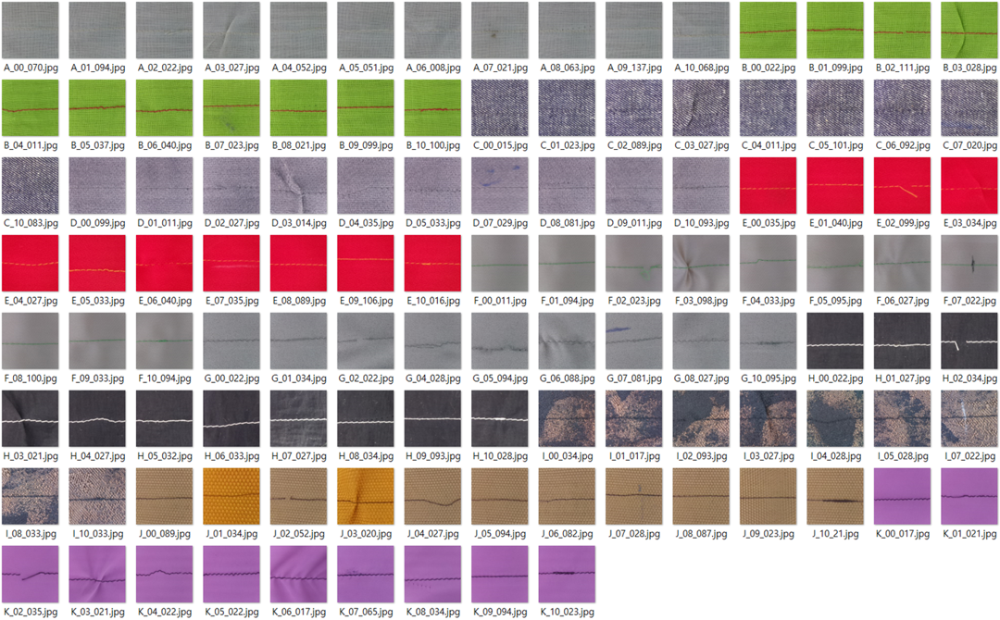

# StitchingNet Dataset
A dataset of 14,565 sewing stitch images for the industrial sewing process

## Motivation
In quality control, a sewing defect refers to inconsistencies in stitches when fabrics are joined together. To develop a method for detecting defects, having image datasets of sewing process data showing both normal and defective stitches is crucial. Even though digital transformation has been rapidly spreading in the manufacturing industry, the fashion industry has been slow to adopt it. The industry heavily relies on labor and is mostly made up of small and medium-sized enterprises (SMEs). Despite significant evolution in design and consumption trends, the garment manufacturing process still relies on outdated sewing machines and low-wage labor. Therefore, the fashion industry lacks well-equipped digital infrastructure like other sectors such as e-commerce and finance. Obtaining diverse and extensive datasets to effectively train recent deep learning models for the sewing process has been challenging due to the lack of monitoring functions on older sewing machines and the repetitive nature of work on the shop floor. Another challenge is that traditional industrial vision sensors for capturing images and detecting defects are costly and require additional computing equipment. This makes it challenging to integrate them with the existing sewing machine, which costs less than $1,000.

## Original publication
* Woo-Kyun Jung, Jingu Kang, Woojin Kwon, Hyungjung Kim, StitchingNet and deep transfer learning method for sewing stitch defect detection, Journal of Computational Design and Engineering, Volume 12, Issue 4, April 2025, Pages 140–154, https://doi.org/10.1093/jcde/qwaf037

## Dataset description
At clothing production sites, various types of sewing defects are a common occurrence. This dataset contains the conditions for defects for each major sewing defect, as determined by experienced sewing workers. The dataset includes data on 11 fabrics, with sewing conditions set for dataset generation by combining threads with similar or opposite fabric colors. This configuration is intended to reflect the color and composition conditions of several fabrics and threads in the dataset, enabling the training of robust deep learning models for sewing defect detection. The potential impact of this dataset on the field of computer vision and textile manufacturing is significant. We captured an average of 221 normal and 103 defective images of 10 cases for each fabric-thread combination.
 * Some defective combinations are undergoing quality improvement.

### Creation details
- Time period: 2022.11 - 2023.03
- Sewing machine: Brother S-7200C-403
- Vision sensor: Raspberry Pi Camera V2
- Image size: **224 x 224 pixels**
- Fabrics used (total 11 types): **A. Cotton, B. Linen, C. Denim, D. Velveteen, E. Polyester, F. Satin, G. Chiffon, H. Nylon, I. Jacquard, J. Oxford, and K. Polyester (coated)**
- Threads used: **Poly and Core**
- Defective classes (total 10 types): **1. Skipped stitch, 2. Broken stitch, 3. Pinched fabric, 4. Crooked seam, 5. Thread sagging, 6. Puckering, 7. Stain and damage, 8. Needle mark, 9. Bobbin thread pulling up, 10. Overlapped stitch**

### Sample images (total 114 images)

## Download data
All StitchingNet data can be downloaded directly from our [Kaggle](https://www.kaggle.com/datasets/hyungjung/stitchingnet-dataset).

## License
The StitchingNet is licensed under [CC BY-NC 4.0](https://creativecommons.org/licenses/by-nc/4.0/). 

## Contact
Please email Woo-Kyun Jung (wkjung@hojeon.co.kr, creator) or Hyungjung Kim (hyungjungkim@konkuk.ac.kr, maintainer) for any questions regarding the dataset.

     
